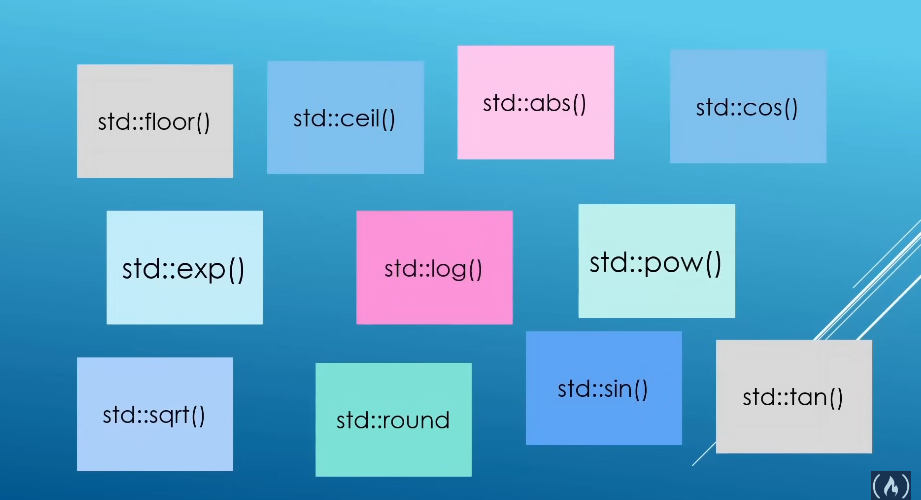
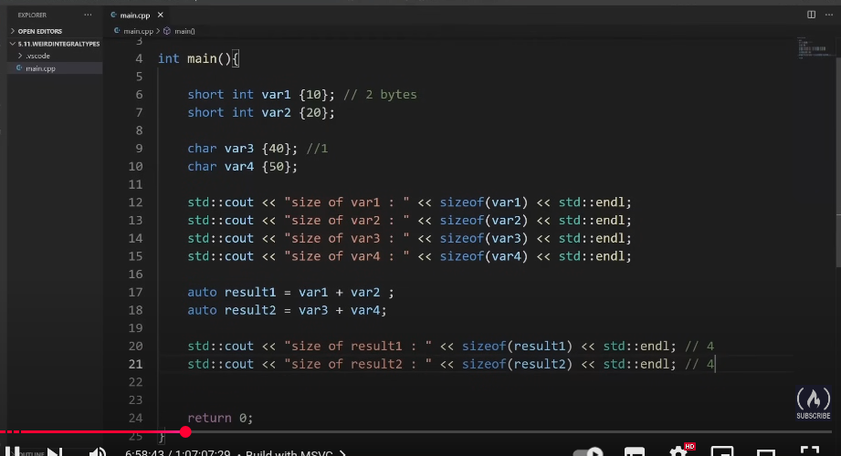

# Topics

---

## - Day3:-

* 1st one (output formating):-

  
* 2nd one (numeric limit):-

  * numeris\_limit `<double>::min` → gives the positive lowest number
  * numeris\_limit `<double>::lowest` → gives the possible lowest number
* 3rd one (math operation):-

  
* 4th one (weird inegral type):-

  * char smallest data type 1 byte
  * can't do normal arithmetic operations on them
  * depends on processor architecture
  * weird thing
  * 
  * as you can see in result 2 the thing is going to become integer
    so the var3 and var4 are going to be changed to integers
  * FLOW CONTRL
* 5th one (IF ELSE):-
* 6th one (Else IF):-
* 7th one (switch):-

---

## `Loop`

* 8th one (for loop):-

  * size\_t:- new brooo it's a unsigned integer variable (only used in iterations)

  ```cpp
  for(size_t i {}; i < n; ++i){
      std::cout << i << std::endl;
  }

  ```
* 9th one (while):-

- 10th one(do-while):-

---
