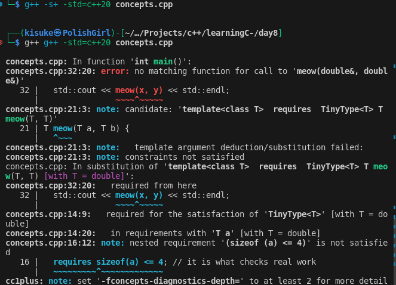
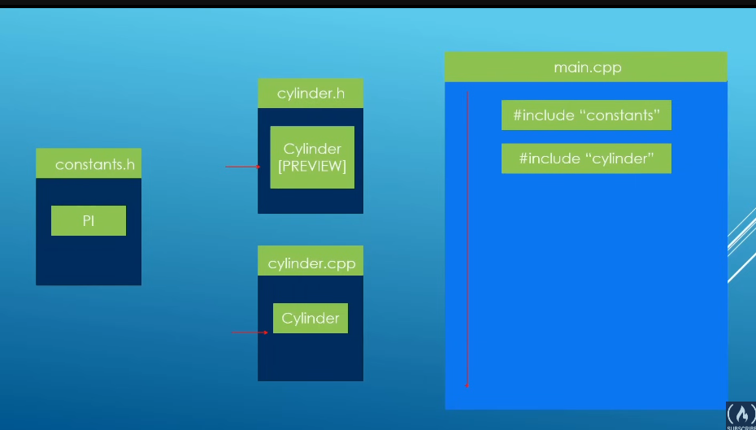
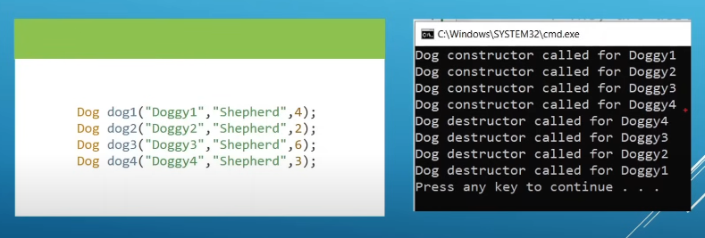
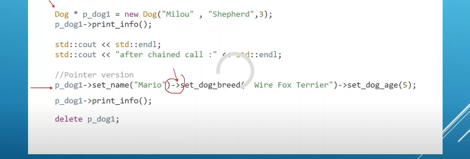

# Topics

---

## - Day8 :-

- 1st one(concepts):-
  - custom one
  - requires term
  - 
  - and or of concepts
- 2nd one(class):-
  - it's a mechanism that let's us to built our own type .
  - it doesn't take real space .
  - its just the blueprint
  - the objects created from it take space
- 3rd one(public):-
  - with it we access the member's of the object
  - in default the  members are private
- 4th one(constructor):-
  - a special kind  of method that constructs an instance of the class
  - it has no return type
  - same name as the class
  - can have parameter or not
  - even if u don't have one the compiler will have a default constructor
    - we just have to say Classname() =default;
  - it should be always public
- 5th one(setters and getters):-
  - getter -> it's let have a value of a private member
  - setter -> it's let set it
  - these should be public
- 6th one (classes in different files):-
  - 
- 7th one(managing object through pointers):-
  - well normal using *
  - but there's other stuff too
  - -> this guy don't need anything
  - just do ptr_obj->func_name();
- 8th one(destroctor):-
  - bullshit
  - so when u want to allocate a mumber's value in heap and delete it when the object dies
  - ~ClassName()
- 9th one(Destructor constructor order):-
  - 
- 10th one(This):-
  - to get the address of current object
  - have used it in python(self)
  - one after another
