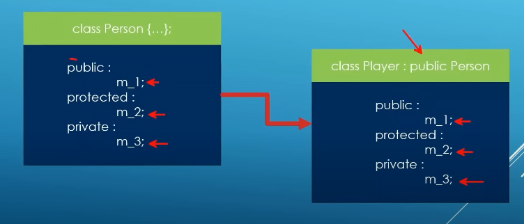
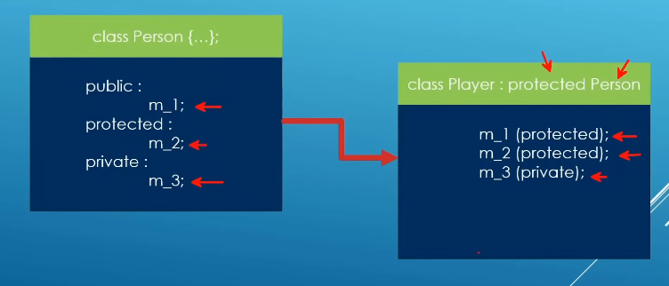
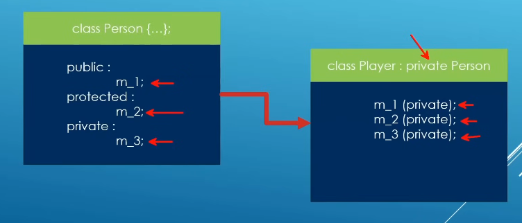
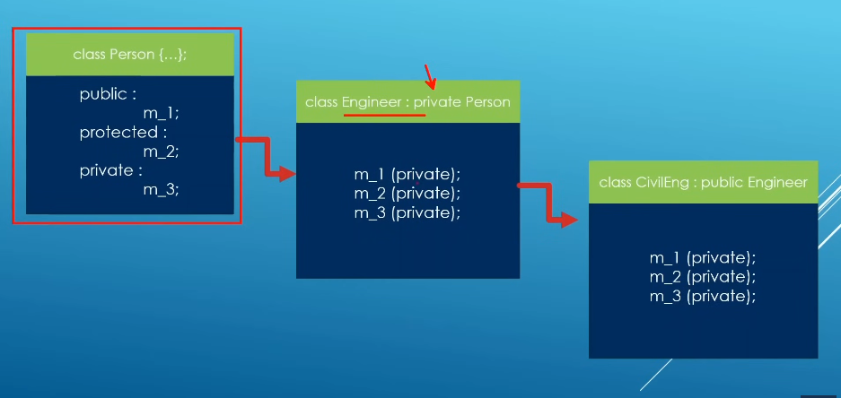
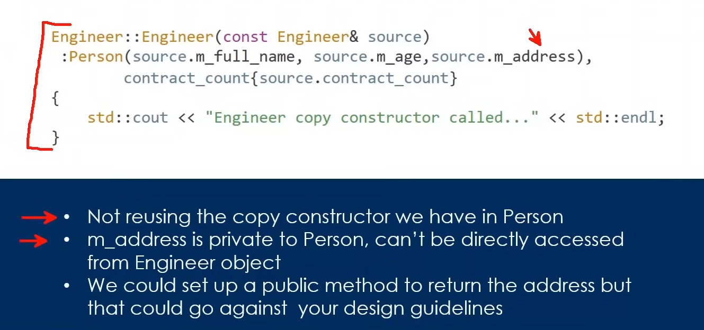
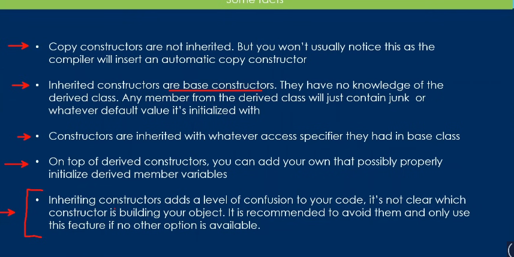

# Topics

---

## - Day9 :-

- 1st one(struct):-

  - just like class but the members are public by default
  - although we can do like class

- 2nd one(size of class):-

  - it literally takes all the members(variables) of the class and sums the size of all of them

- 3rd one(Inheritance):-

  - real dope shit
  - there are 3 ways of doing it
  - public, protected and private
  - with the public one the inheriting class can't access the parent class's private variables

- 4th one(protected):-

  - protected it's like the member type
  - with it you can access them from the child class
  - but u can't access them from outside like main
  - like if you want to p1.name="hello" [in main] you can't do that

- 5th one(inheritance type):-

  - public one->
  - protected one->
  - private one ->

- 6th one(private inheritance):-

  - 
  - bitch takes everything from others but doesn't give anything to others

- 7th one(resecurring variables):-

  - here you have to define the access level u want
  - have to use the public getter function with `using`
  - in c++ there's always if a door is closed a trap door is always kept open

- 8th one(default arg constuctor with inheritance):-

  - here the most parent one is called then the next one and it goes on
  - not much hard

- 9th one (custom one):-

  - pretty simple
  - just have to initialize the child class with the parent class and then do whaever is new

- 10th one(copy constructor):-

  - here we pass one object as the input of constructor

    

    bad design - it just creates copy of all the variables

  - ans -> just send it, copliler is smart enough
  - 11th one(inheriting base constructor):-
  - 12th one(inheritance with destructors):-

    - here it follows the oposite of creating the constructor
    - basically at first the most child class gets deleted then their parent and so on

  - 13 th one(same name of parent and child object):-

    - here the child overwrites the parent
    - we can still access the parent with the Parent_Class_name::
