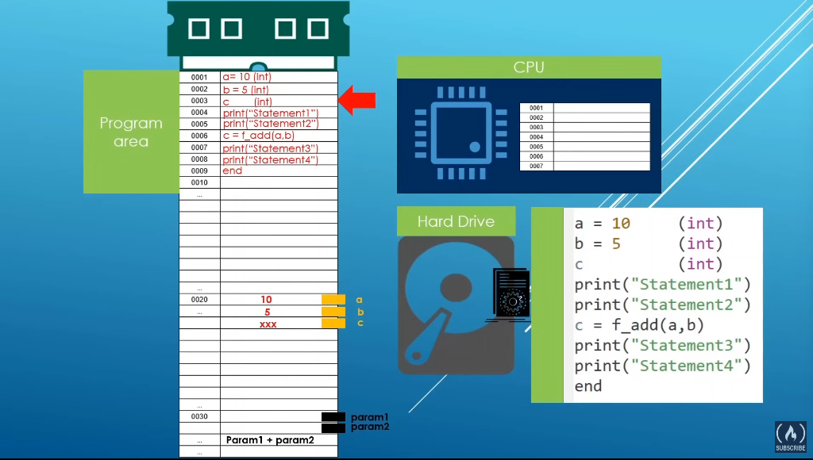

# Path: -

- Day1: -
  - 1st one(in the beninging):-

    - entry point -> **int main(),
    - **iostream -> provides input and output as stream as c++ doesn't have it (noob)
    - printed my details 10 times
  - 2nd one(comment):-

    - // one line comment
    - /*__*/ more than one line of comment (can't do nesting of comment throws error.
  - 3rd one(oh no moment error):-

    - compile time error:- can be detectef while compiling. compiler stops before compiling.
    - runtime error:- compiler doesn't stop and compile it. after compilatin we come to know
    - warnings:- doesn't affect but asks it's exixtenece in code(why is it here)

      ```bash
      g++ -Wall code.cpp -o eer
      ```

    shows the warnings
  - 4th one(statement and functions):-

    - statement:- basic unit of computation
    - function :- block of code that does some work which can be reused
  - 5th one(input and output):-

    - cin cout cerr clog ->easy
    - getline-> interesting so it helps in read everything you give like space dinosaure everything will read whole sentence
      then do stuff
  - 6th one(C++ Program Execution Model & Memory Model):-

    - 

    round 2(variables and data types)
  - 7th one:-
