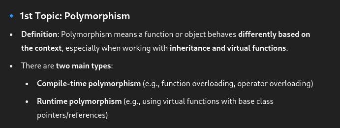
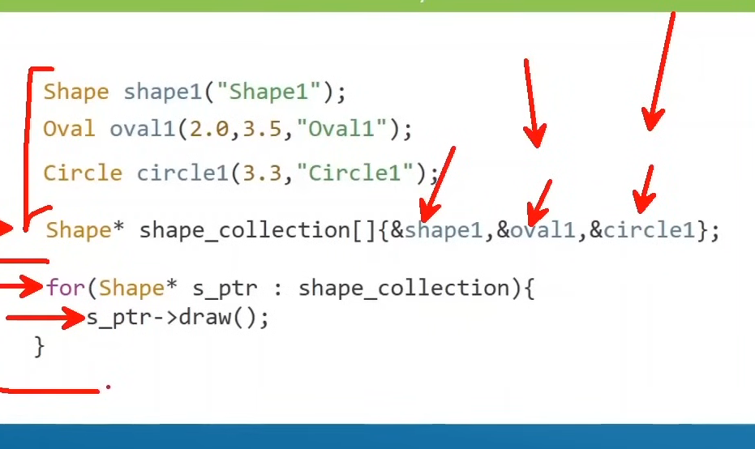
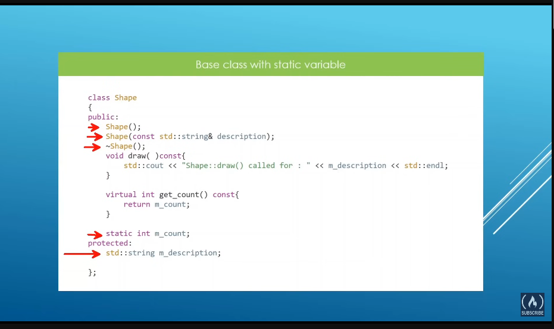

# Topics

---

## - Day10.1 :-

- 1st one(Polymorphism):-

  - this type of function will do different work according to the object type (at runtime)
  - the base class pointer can also be a reference (e.g., `Parent& p = child_obj`)
  - parent \*p1=new child; if we do it ----

    - if the base class function is **virtual** , the overridden `Child` version is called
    - the opposite (`Child* = new Parent`) is not allowed, because `Parent` might not have all members of `Child`
  - chatgpt:-

    - 
  - > **why do we need polymorphim????**
    >

    - in python we can make an array of any datatype. int ,char whatever together but in c we can't do that. for it we can make a parent class and make derived classess of them with which we can keep then in a array of the parent class
    - without it we can only keep a collection of the same type
    - 
- 2nd one(virtual function):-

  - to get the functions of the child we use it
  - it is the one that gets overridden and does the intended work
  - it's the real implementation of polymorphism . it will be using dynamic binding
- 3rd one(size of dynamic binding and slicing):-

  - well dynamic binding takes more space than we expect
  - so basically at the time of assigning a child class, the parent class will keep only the members available in him not those the child one externally has **[Slicing]**
  - if we make a collection of such childen with the referencing it will not still slice the data the sliced members are lost and never reuseable
- 4th one(override):-

  - it overrides the previous same named function
  - it can only override existing functions available in parent class
- 5th one(polymorphism and inheritance on static members):-

  - as u know static members of a class are those ,members who are not asociated with the object but the class himself
  - 
  - so usually when we are calling the child class the static member is usally changed as the child itself is a derived form of the parent class
  - so if we create same named static variable in the child class we'll a new static variable for that class , but the parent one will be workning on its own
