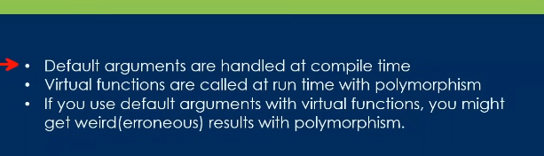
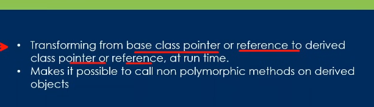
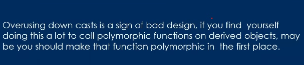
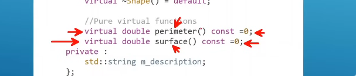
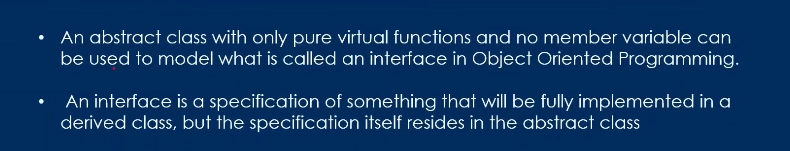

# Topics

---

## - Day10.2 :-

- 1st one(final):-

  - suppose some member of the parent class aren't supposed to be overriden
  - for it we use final.
  - the children will not be able to override it
  - we can also restrict people from inheriting the class further by using final
  - **_disclaimer_**:-
    - if we keep a virtual function in a final class then the tetminal will allow it
    - but as it is final further class cannot inherit
    - so it is nuisence

- 2nd one(virtual functions with default arguments):-

  - 
  - here the default arguments of the virtual function of the base class will be used in the children one

- 3rd one(Virtual Destructor):-

  - basically have to use the virtual destructor

- 4th one(dynamic cast):-

  - 
  - here after making a poniter or refence of the children class to the base class, we change it back to the child class using it
  - **_Disclaimer_** :-

    - 

- 5th one(never virtual functions from constructor and destructor):-

  - basically it will give static binding

- 6th one(abstacct class and pure virtual function ):-

  - The functions are supposed to be overridden by other classes
  - the format:-
    - 
  - if a class has atleast one such function like this the class automatically becomes an abstract class
  - it means we can not crate objects of this class
  - the compiler will say error

- 7th one(Abstact class as interfaces):-

  - 
  -
