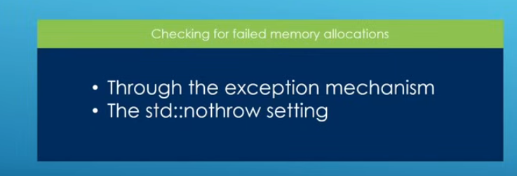
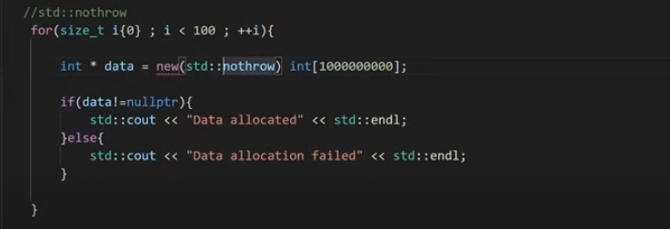
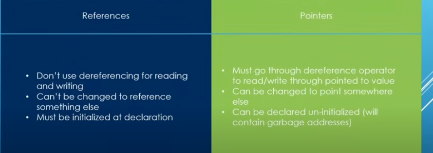

# Topics

---

## - Day5:-

- 1st one(dangling pointers):-
  a pointer that doesn't point to valid memory address. It results in undefined behaviour
  - Uninitialized pointer
  - deleted pointer
  - multiple pointer pointing to same location
  - solutions:->
    - inintiualize pointers
    - reset ppointers after delete
    - for multiple pointer make sure the owner pointer is always clear
- 2nd one(whatif new fails):-
  - it will crash
  - solution:-
    - 
    - 
- 3rd one(safety of null pointer):-
- 4th one(Memory Leaks):-
- 5th one(dynamic array):-
- 6th one(references):-
  - 
- 7th one(character manipulation and Strings):- # all has stf before them like `std::isalnum('m')`
  - isalpha('x') ->tells if alphabatic or not.
  - isalnum
  - toupper
  - isblank
  - islower
  - isupper
  - isdigit
- 8th one(length):-
  - std::strlen(a) -> gives length of char array, string and pointer
  - std::strcmp(a,b) -> gives difference between indexes of the given characters. size of a and b should be same
  - std::strchr(*pointer ,b) -> gives the pointer which is same as b in pointer/string
- 9th one(manipulayion on string):-
  - strcat(dest,source,length) ->concats
  - strcpy() -> copys
- 10th one(string):-
