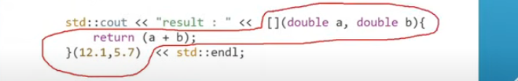

# Topics

---

## - Day6:-

- 1st one(lamda function):-

  - 
  - ```cpp
    auto func = [/*capture list from outside*/] (/*parameters*/) -> int /*return type*/{
    	return 25; /*function body*/
    };
    ```
  - oh my god!
- 2nd one(capture list):-

  - it lets some variables' value to be used in the function
  - it can not change it unless we send the refernce of it
  - = -> for capturing all variables
  - & -> for all reference
- 3rd one(Function template):-

  - it's just a blueprint of the function
  - it is not real code
  - it is not created unless it is called . suppose u have a function template
    now if you happen to use only the int one the other types ones will not be created
  - here's the insight of it

    ```cpp
    #include <iostream>
    using namespace std;

    template<typename T>
    T maxenter(T a, T b);

    /* First instantiated from: insights.cpp:23 */
    #ifdef INSIGHTS_USE_TEMPLATE
    template<>
    std::basic_string<char> maxenter<std::basic_string<char> >(std::basic_string<char> a, std::basic_string<char> b)
    {
      return std::basic_string<char>((std::operator>(a, b)) ? a : b);
    }
    #endif

    /* First instantiated from: insights.cpp:24 */
    #ifdef INSIGHTS_USE_TEMPLATE
    template<>
    int maxenter<int>(int a, int b)
    {
      return (a > b) ? a : b;
    }
    #endif

    /* First instantiated from: insights.cpp:25 */
    #ifdef INSIGHTS_USE_TEMPLATE
    template<>
    double maxenter<double>(double a, double b)
    {
      return (a > b) ? a : b;
    }
    #endif

    template<typename T>
    T sum(T & a, T & b);

    /* First instantiated from: insights.cpp:32 */
    #ifdef INSIGHTS_USE_TEMPLATE
    template<>
    int sum<int>(int & a, int & b)
    {
      return (a + b) * 10;
    }
    #endif

    /* First instantiated from: insights.cpp:33 */
    #ifdef INSIGHTS_USE_TEMPLATE
    template<>
    double sum<double>(double & a, double & b)
    {
      return (a + b) * 10;
    }
    #endif

    template<>
    std::basic_string<char> sum<std::basic_string<char> >(std::basic_string<char> & a, std::basic_string<char> & b)
    {
      std::basic_string<char> result = std::operator+(a, b);
      std::basic_string<char> repeated = std::basic_string<char>() /* NRVO variable */;
      for(int i = 0; i < 10; ++i) {
        repeated.operator+=(result);
      }

      return repeated;
    }

    int main()
    {
      std::basic_string<char> a = std::basic_string<char>{"ayo bro", std::allocator<char>()};
      std::basic_string<char> b = std::basic_string<char>{"byo bro", std::allocator<char>()};
      int x = {10};
      int y = {20};
      double p = {20.300000000000001};
      double q = {23.5};
      std::basic_string<char> ans1 = maxenter(std::basic_string<char>(a), std::basic_string<char>(b));
      int ans2 = maxenter(x, y);
      double ans3 = maxenter(p, q);
      std::operator<<(std::operator<<(std::cout, "1 : "), ans1).operator<<(std::endl);
      std::operator<<(std::cout, "2 : ").operator<<(ans2).operator<<(std::endl);
      std::operator<<(std::cout, "3 : ").operator<<(ans3).operator<<(std::endl);
      std::basic_string<char> sum1 = sum(a, b);
      int sum2 = sum(x, y);
      double sum3 = sum(p, q);
      std::operator<<(std::operator<<(std::cout, "Sum 1 (string): "), sum1).operator<<(std::endl);
      std::operator<<(std::cout, "Sum 2 (int): ").operator<<(sum2).operator<<(std::endl);
      std::operator<<(std::cout, "Sum 3 (double): ").operator<<(sum3).operator<<(std::endl);
      return 0;
    }

    template<typename T>
    T maxenter(T a, T b)
    {
      return (operator>(a, b)) ? a : b;
    }

    /* First instantiated from: insights.cpp:23 */
    #ifdef INSIGHTS_USE_TEMPLATE
    template<>
    std::basic_string<char> maxenter<std::basic_string<char> >(std::basic_string<char> a, std::basic_string<char> b)
    {
      return std::basic_string<char>((std::operator>(a, b)) ? a : b);
    }
    #endif

    /* First instantiated from: insights.cpp:24 */
    #ifdef INSIGHTS_USE_TEMPLATE
    template<>
    int maxenter<int>(int a, int b)
    {
      return (a > b) ? a : b;
    }
    #endif

    /* First instantiated from: insights.cpp:25 */
    #ifdef INSIGHTS_USE_TEMPLATE
    template<>
    double maxenter<double>(double a, double b)
    {
      return (a > b) ? a : b;
    }
    #endif

    template<typename T>
    T sum(T & a, T & b)
    {
      return (operator+(a, b)) * 10;
    }

    /* First instantiated from: insights.cpp:32 */
    #ifdef INSIGHTS_USE_TEMPLATE
    template<>
    int sum<int>(int & a, int & b)
    {
      return (a + b) * 10;
    }
    #endif

    /* First instantiated from: insights.cpp:33 */
    #ifdef INSIGHTS_USE_TEMPLATE
    template<>
    double sum<double>(double & a, double & b)
    {
      return (a + b) * 10;
    }
    #endif
    ```
  - also we can explicitly declare the type suppose we want a  double type output of some function
    so we will call it like

    ```cpp
    func_name<double>(int{32}, int{32});
    ```
- 4th one(concepts):-
